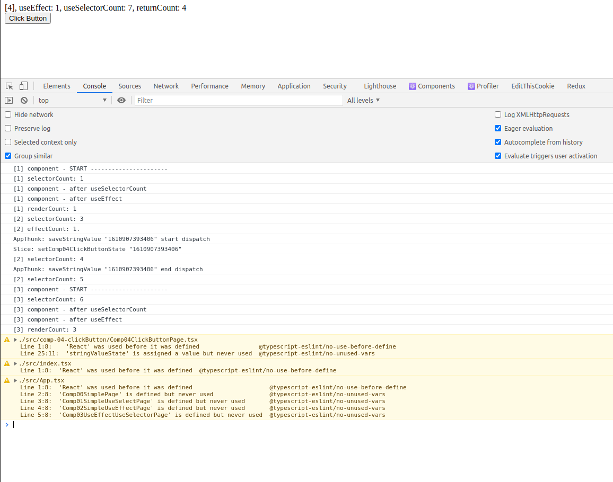

# Introduction
Each sub-folder is a separated React app, please view README.md in each of them for more information.

## `pro-00-old-react-version` and `pro-01-redux-simple`
Both of application has exactly the same logic, the only difference is React version (configured in `package.json`).
And the most surprising thing is, their log console are totally different.<p/>

`pro-00-old-react-version`:\

- The log is understandable: the message `compontent - START` always appear when the countNumber increase. That's works the same way it was coded (in `Comp04ClickButtonPage`). 
  And the number in the web page is exactly the same as number on the console log:
  - componentCount: 4
  - useSelectorCount: 7
  - returnCount: 4

--------------------------------------------
`pro-01-redux-simple`:\

- I cannot understand the log: the message `compontent - START` didn't appear when the count number increase from 1 to 2 (line 6 in console log) even though the logic in `Comp04ClickButtonPage` doesn't change.
- Why in the UI, the result is totally different from the console log? 
  - componentCount: 4 # 3
  - useSelectorCount: 7 # 6
  - returnCount: 4 # 3


Below are some general guideline which could be applied for all sub-folder:
# The general guideline for each sub-folder
## Build application
Run following to install all required dependencies:
```
npm install
```
After that, it may show warning with a suggestion to run `npm audit fix`, and use the `--force` option if necessary like this:
```
npm audit fix --force
```
## Start application
Then run following to start development server:
```
npm start
```

## Clean `node_modules` folder
Use `./fastclean_target.sh` (Linux) or `fastclean_target.bat` (Windows)

## Upgrade dependencies
Upgrade minor version: `./upgrade-minor.sh`
Upgrade major version: `./upgrade-major.sh`

## Troubleshooting
- https://stackoverflow.com/questions/42308879/how-to-solve-npm-error-npm-err-code-elifecycle
  `npm cache clean --force` (or `npm cache verify`
  delete `node_modules` folder
  delete `package-lock.json` file
  `npm install`
